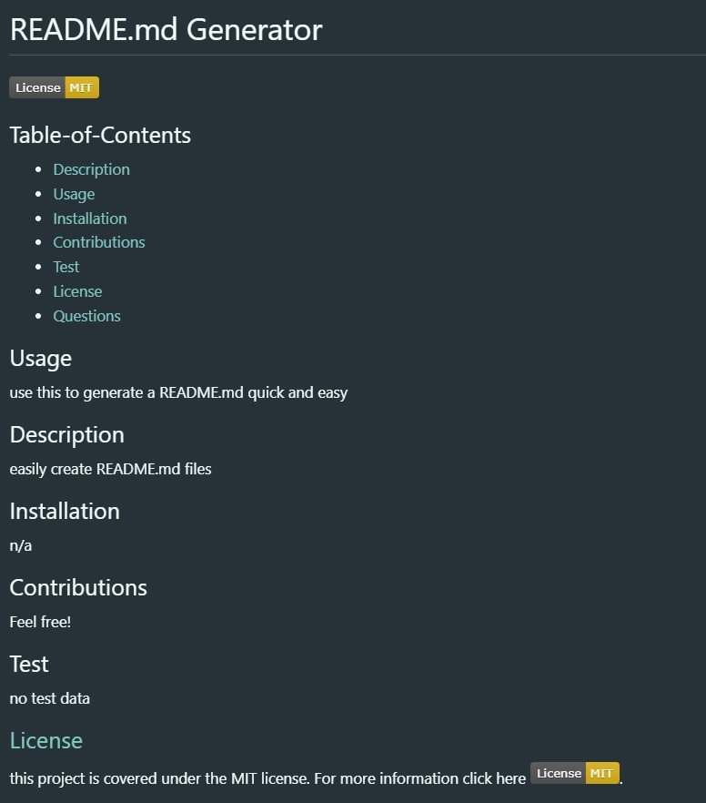

# easy-README.md

Challenge 9. Node.js Challenge: Professional README Generator

When creating an open source project on GitHub, it’s important to have a high-quality README for the app. This should include what the app is for, how to use the app, how to install it, how to report issues, and how to make contributions—this last part increases the likelihood that other developers will contribute to the success of the project.

## App details:

- Command-line application that accepts user input
- When prompted for information about your application repository then a high-quality, professional README.md is generated with the title of my project and sections entitled Description, Table of Contents, Installation, Usage, License, Contributing, Tests, and Questions
- When the user enters their project title this is displayed as the title of the README
- When the user enters a description, installation instructions, usage information, contribution guidelines, and test instructions this information is added to the sections of the README entitled Description, Installation, Usage, Contributing, and Tests
- When the user chooses a license for their application from a list of options a badge for that license is added near the top of the README and a notice is added to the section of the README entitled License that explains which license the application is covered under
- When the user enter their GitHub username this is added to the section of the README entitled Questions, with a link to their GitHub profile
- When the user enters their email address this is added to the section of the README entitled Questions, with instructions on how to reach them with additional questions
- When the user clicks on the links in the Table of Contents they are taken to the corresponding section of the README

### Demo Link:

[HERE](https://drive.google.com/file/d/1FIydFvxTs2o9888W0cHfoPEhjRK8nFFY/view)

### Layout:

